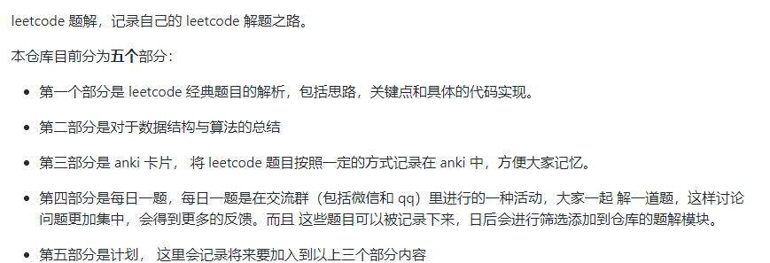
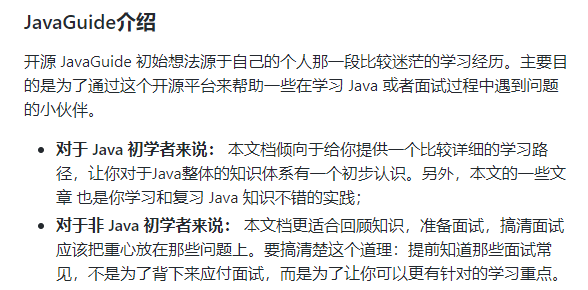

# Awesome-Programmer-Source
专注分享高质量程序员相关资源，包括优质文章、教程、GitHub（Gitee）仓库、公众号等优质资源

## 数据结构与算法

|资源名称|资源分类|资源描述|
|-|-|-|
|[LeetCode](https://leetcode-cn.com/)|刷题网站|刷题必备，学习算法没刷过LeetCode等于白学。|
|[一个月200题,命中80%,拿下BAT,我独特的高效刷题法](https://mp.weixin.qq.com/s/xr2abGNv8wDZJ-qyN4KewQ)|公众号文章|公众号**陈同学在搬砖**分享，号主硕士应届生，已获字节跳动、阿里巴巴、腾讯、华为offer，该文章详细介绍了刷题方法和步骤，并且指定了210道高频算法题，跟着大神走，offer不用愁👍|
|[小浩算法](https://github.com/geekxh/hello-algorithm)|GitHub仓库|该仓库目前共完成 140+ 道高频面试算法题目，总计 30w 字，全部采用漫画图解的方式，简单易懂，适合初中级读者。|
|[算法模板](https://github.com/greyireland/algorithm-pattern)|GitHub仓库|算法模板，最科学的刷题方式，最快速的刷题路径，一个月从入门到 offer，你值得拥有 🐶~|
|[labuladong 的算法小抄](https://github.com/labuladong/fucking-algorithm)|GitHub仓库|本仓库总共 60 多篇原创文章，都是基于 LeetCode 的题目，涵盖了所有题型和技巧，而且一定要做到举一反三，通俗易懂，绝不是简单的代码堆砌。|
|[力扣加加](https://github.com/azl397985856/leetcode)|GitHub仓库||
|[doocs/leetcode](https://github.com/doocs/leetcode)|GitHub仓库|本项目包含 LeetCode、《剑指 Offer（第 2 版）》、《程序员面试金典（第 6 版）》等题目的相关题解。所有题解均由多种编程语言实现，包括但不限于：Java、Python、C++、JavaScript、C#、Go，日常更新。|
|[leetcode-master](https://github.com/youngyangyang04/leetcode-master)|GitHub仓库|如果你在刷leetcode，强烈建议先按照本攻略刷题顺序来刷，刷完了你会发现对整个知识体系有一个质的飞跃，不用在题海茫然的寻找方向。|
|[LeetcodeTop](https://github.com/afatcoder/LeetcodeTop)|GitHub仓库|本仓库用于汇总互联网公司技术岗考察Leetcode题目的热度🔥，帮助同学们更加有针对性地准备面试。|
|[令狐冲的算法小抄](https://github.com/ninechapter-algorithm/linghu-algorithm-templete)|GitHub仓库|在面试超过200人以后，看到不少准备了很久的同学，一到coding环节依旧无从下手，刷题刷了个寂寞。我也把自己在做题时的技巧整理成一份Cheatsheet。内容主要根据我面过这么多大厂，和面试过这么多人以后，把高频知识点做了一个总结，并归纳出了算法模板.|

## 设计模式
|资源名称|资源分类|资源描述|
|-|-|-|
|[设计模式](https://refactoringguru.cn/design-patterns)|教程网站|设计模式学习必备，通俗易懂|

## 架构
|资源名称|资源分类|资源描述|
|-|-|-|
|畅谈云原生|云原生|[畅谈云原生（上）：云原生应用应该是什么样子？](https://www.infoq.cn/article/fa42rfjv*dygavranfqe) [畅谈云原生（下）：云原生的飞轮理论](https://www.infoq.cn/article/HMizcSG_FgcJKGzkE08L)|
|[后端架构师技术图谱](https://github.com/xingshaocheng/architect-awesome)|聚合|后端架构师技术图谱|

## Java
|资源名称|资源分类|资源描述|
|-|-|-|
|[HOW2J](https://how2j.cn/)|教程网站|本站提供Java学习路线，内容基础并带有代码范例，适合初中级Java读者。按照该教程学习做个小项目（毕业设计等）轻轻松松。👌|
|[JavaWeb源码分享](https://github.com/coderzcr/JavaWeb-Project-Source-Share)|GitHub仓库|🌱🚀分享基于Servlet、SSH、SSM、SpringBoot等流行技术实现的JavaWeb项目。自卖自夸一下，是鄙人收集整理并分享的JavaWeb源码，当前已分享60+的优质源码。|
|[Java 程序员常读书单](https://github.com/itwanger/JavaBooks)|GitHub仓库|Java 程序员常读书单整理，附下载地址，助力构建最强知识体系。但不限于 Java，包括设计模式、计算机网络、操作系统、数据库、数据结构与算法、大数据、架构、面试等等。|
|[JVM 底层原理最全知识总结](https://github.com/doocs/jvm)|GitHub仓库|这里仅仅记录了一些笔者认为需要重点掌握的 JVM 知识点，如果你想更加全面地了解 JVM 底层原理，可以阅读周志明老师《深入理解 Java 虚拟机——JVM 高级特性与最佳实践(第 2/3 版)》全书。|
|[Java 全栈知识体系](https://www.pdai.tech/)|优质网站|你好，我是pdai。你是否也曾对未来迷茫不知方向，也曾每天在碎片化的学习中焦虑，也曾钦羡他人步入高于你的层次?  那么跟随我，结合BAT大厂面试题帮你构筑你自己的知识体系，提升靠技术实现自我价值的概率和掌控力；而往往当你将本文中知识点掌握时，你会发现那些平时高谈阔论的家伙其实都是纸老虎；但你依然要保持谦卑，闻道有先后，术业有专攻，如是而已。|
|[一个简单java程序的运行全过程](https://www.cnblogs.com/dqrcsc/p/4671879.html)|优质文章|java程序的执行过程|

## Python
|资源名称|资源分类|资源描述|
|-|-|-|
|[PythonPark](https://github.com/Jack-Cherish/PythonPark)|GitHub仓库|这里是学习 Python 的乐园，保姆级教程：AI实验室、宝藏视频、数据结构、学习指南、机器学习实战、深度学习实战、Python基础、网络爬虫、大厂面经、程序人生、资源分享。|

## 大数据
|资源名称|资源分类|资源描述|
|-|-|-|
|[大数据成神之路](https://github.com/wangzhiwubigdata/God-Of-BigData)|GitHub仓库|专注大数据学习面试，大数据成神之路开启。|
|[大数据入门指南 ⭐](https://github.com/heibaiying/BigData-Notes)|GitHub仓库|大数据入门指南|

## 机器学习
|资源名称|资源分类|资源描述|
|-|-|-|
|[什么是人工智能](https://github.com/coderzcr/Awesome-Programmer-Source/blob/master/picture/%E4%BB%80%E4%B9%88%E6%98%AF%E4%BA%BA%E5%B7%A5%E6%99%BA%E8%83%BD.png)|优质文章|漫画版：什么是人工智能|
|[什么是机器学习](https://github.com/coderzcr/Awesome-Programmer-Source/blob/master/picture/%E4%BB%80%E4%B9%88%E6%98%AF%E6%9C%BA%E5%99%A8%E5%AD%A6%E4%B9%A0.png)|优质文章|漫画版：什么是机器学习|
|[什么是深度学习](https://github.com/coderzcr/Awesome-Programmer-Source/blob/master/picture/%E4%BB%80%E4%B9%88%E6%98%AF%E6%B7%B1%E5%BA%A6%E5%AD%A6%E4%B9%A0.png)|优质文章|漫画版：什么是深度学习|
|[什么是神经网络](https://github.com/coderzcr/Awesome-Programmer-Source/blob/master/picture/%E4%BB%80%E4%B9%88%E6%98%AF%E7%A5%9E%E7%BB%8F%E7%BD%91%E7%BB%9C.png)|优质文章|漫画版：什么是神经网络|

## 性能调优
|资源名称|资源分类|资源描述|
|-|-|-|
|[Linux性能调优](http://www.brendangregg.com/linuxperf.html)|优质网站|国外大佬整理的性能调优工具。|

## 面试
|资源名称|资源分类|资源描述|
|-|-|-|
|[JavaGuide](https://github.com/Snailclimb/JavaGuide)|GitHub仓库||
|[JavaGuide面试突击版](https://github.com/Snailclimb/JavaGuide-Interview)|GitHub仓库|JavaGuide仓库内容全而多，适合有长时间准备的人，JavaGuide面试突击版是为时间不足的面试者准备的。|
|[javaP7](https://github.com/idaSmilence/javaP7)|GitHub仓库|作者凭借着整理的这份资料，加上leetcode刷的将近600道题，一个月的时间内，拿到了蚂蚁金服、快手、拼多多、淘宝、微软等大厂offer|
|[JavaFamily](https://github.com/AobingJava/JavaFamily)|GitHub仓库|【Java面试+Java学习指南】 一份涵盖大部分Java程序员所需要掌握的核心知识。|
|[CodeGuide](https://github.com/fuzhengwei/CodeGuide)|GitHub仓库|📚 本代码库是作者小傅哥多年从事一线互联网 Java 开发的学习历程技术汇总，旨在为大家提供一个清晰详细的学习教程，侧重点更倾向编写Java核心内容。如果本仓库能为您提供帮助，请给予支持(关注、点赞、分享)！|

## 常用工具
|资源名称|资源分类|资源描述|
|-|-|-|
|[GitHub 加速下载](http://toolwa.com/github/)|代理网站|该网站是为了解决国内GitHub下载的速度过慢的问题，通过该网站可以快速下载源码|
|[在线工具秘籍](https://github.com/zhaoolee/OnlineToolsBook)|GitHub仓库|从用户角度出发，「理想的工具应该是无需安装, 打开浏览器即可使用」 也就是所谓的在线工具。为在线工具写一本优质开源中文说明书, 让在线工具造福人类|
|[谷粒-Chrome插件英雄榜](https://github.com/zhaoolee/ChromeAppHeroes)|GitHub仓库|🌈谷粒-Chrome插件英雄榜, 为优秀的Chrome插件写一本中文说明书, 让Chrome插件英雄们造福人类~|
|[今日热榜](https://tophub.today/)|聚合网站|今日热榜提供各站热榜聚合：微信、今日头条、百度、知乎、V2EX、微博、贴吧、豆瓣、天涯、虎扑、Github、抖音...追踪全网热点、简单高效阅读。|
|[华为开源镜像站](https://mirrors.huaweicloud.com/)|镜像网站|解决国外工具下载慢的问题，比如常用的Tomcat、nginx等。|
|[房贷计算器](http://www.baiozhuntuixing.com/)|工具|房贷计算器2021|
|[excalidraw](https://excalidraw.com/)|工具|一个开源免费的画图软件|
|[diagrams](https://www.diagrams.net/)|工具|一款免费、在线、功能强大的画流程图的工具|
|[课程搜](https://www.kcsou.com/)|课程聚合|搜课程，搜教程，就来 "课程搜" -- 在线搜课神器|
|[绝妙的个人生产力](https://github.com/eastlakeside/awesome-productivity-cn)|GitHub仓库|这是一份开放的由中文社区共建的绝妙系列精选资源清单，专注于提升个人生产力的知识方法和工具。|
|[名校公开课程评价网](https://github.com/conanhujinming/comments-for-awesome-courses)|GitHub仓库|整合大家对于高质量公开课程的评价、总结、与建议等等，期望这些评价能对后来的同学在选择、学习课程的时候能有一些帮助。|
|[知犀思维导图](https://www.zhixi.com/)|工具|知犀思维导图是一个完全免费的宝藏在线思维导图工具。|
|[熊猫搜书](https://xmsoushu.com/)|工具|熊猫搜书是一个非常好用的电子书导航网站，一个网站相当于很多个网站。|
|[mdnice](https://editor.mdnice.com/)|工具|mdnice 是一款 Markdown 微信编辑器，拥有良好的兼容性、海量主题样式、免费的图床、强大的技术团队，提供文章一键排版，同时支持知乎、掘金、微信订阅号等多个平台。|

## 综合
|资源名称|资源分类|资源描述|
|-|-|-|
|[编程导航](https://www.code-nav.cn/)|聚合网站|💎 专业的编程导航，帮你找到优质的编程学习资源！|
|[DMZ社区(IT学习网)](http://www.dmzshequ.com/)|聚合网站|一个最新前沿实用的IT技术学习网站-专注于IT学习资源分享的社区-dmz社区|
|[阿里云-开发者社区-藏经阁](https://developer.aliyun.com/ebook/index/__0_0_0_6?spm=a2c6h.20345107.ebook-index.35.3a054e64STnXIE#ebook-list)|聚合网站|汇聚阿里巴巴技术实践精华，涵盖云原生、物联网、大数据、AI 等技术领域，深度分享阿里工程师实战经验，顶级技术内容一手掌握。|
|[吾爱优质资源网](https://www.52yzzy.com/)|聚合网站|吾爱优质资源网-专注于最新最前沿IT编程教程的IT资源分享社区|
|[程序员相关电子书资料](https://github.com/tangtangcoding/C-C-)|GitHub仓库|程序员相关电子书资料免费分享|
|[最新 1000 多本计算机电子书免费下载](https://github.com/itdevbooks/pdf)|GitHub仓库|计算机类电子书下载，编程电子书整理下载|
|[免费程序员书籍汇总](https://github.com/EbookFoundation/free-programming-books/)|GitHub仓库|提供免费的程序员书籍|
|[计算机书籍汇总](https://github.com/coderzcr/ComputerBooks)|GitHub仓库|提供免费的计算机书籍|
|[经典的编程书单大全](https://github.com/imarvinle/awesome-cs-books/)|GitHub仓库|这里汇集如下主题的经典书籍： 编程语言(Java、C++、C、Python等等)、操作系统、计算机网络、系统架构、设计模式、程序员数学、测试、中间件、前端开发、后台开发、网络编程、Linux使用及内核、求职面试、**算法与数据结构**、 安卓、IOS、数据库、Redis等主流的编程学习书籍。|
|[程序员超级清单](https://github.com/sdmg15/Best-websites-a-programmer-should-visit)|GitHub仓库|从新手入门的通用工具、编码建议、代码训练，到进一步提升自己的论坛频道、网课推荐、编程比赛，甚至还有工作职位的相关链接。|
|[可以拿来变现的小程序源码](https://github.com/JackonYang/list-of-wechat-mini-program-list)|GitHub仓库|可以拿来变现的小程序源码。|
|[值得一看的好书](https://github.com/fuzhengwei/CodeGuide/wiki/%E5%80%BC%E5%BE%97%E4%B8%80%E7%9C%8B%E7%9A%84%E5%A5%BD%E4%B9%A6)|GitHub仓库|小傅哥倾情推荐。|
|[程序员应该访问的最佳网站](https://github.com/sdmg15/Best-websites-a-programmer-should-visit)|GitHub仓库|一些对程序员有用的网站|
|[50 TECH WEBSITES TO FOLLOW IN 2020](https://get.tech/blog/50-tech-websites-to-follow-in-2020/#Best_websites_for_all_things_tech)|聚合网站|🐱‍🏍50个国外的技术网站，适合学习英文、了解国外先进技术|
|[作为程序员，你关注哪些国外 IT 网站？](https://www.zhihu.com/question/26155575)|聚合网站|国外 IT 网站集合|
|[互联网公司常用框架源码赏析](https://github.com/doocs/source-code-hunter)|GitHub仓库|“技术深度” 与 “技术广度”是对开发者来说最为重要的两个维度，本项目致力于从源码层面，剖析和挖掘互联网行业主流技术的底层实现原理，为广大开发者 “提升技术深度” 提供便利。|
|[如何成为一名后端开发工程师（附路线图）](https://markdowner.net/article/170940730528129024)|精品文章|现在的 Web 开发与几年前完全不同。有很多新东西让刚进入 Web 领域的开发人员感到很困惑。这也是我决定逐步制作这个直观的指南来展示 Web 概况的原因之一，可以让任何人都清楚他在 Web 开发中所处的角色和必备的条件。|
|[为什么这么设计系列文章](https://draven.co/whys-the-design/)|优质网站|为什么这么设计（Why’s THE Design）是一系列关于计算机领域中程序设计决策的文章，我们在这个系列的每一篇文章中都会提出一个具体的问题并从不同的角度讨论这种设计的优缺点、对具体实现造成的影响。|
|[编程自学之路](https://github.com/rd2coding/Road2Coding)|GitHub仓库|本仓库取名 r2coding，即 Road To Coding，意为「编程自学之路」，是自学编程以来所用资源和分享内容的大聚合。|
|[中文独立博客列表](https://github.com/timqian/chinese-independent-blogs)|GitHub仓库|中文独立博客列表。|

